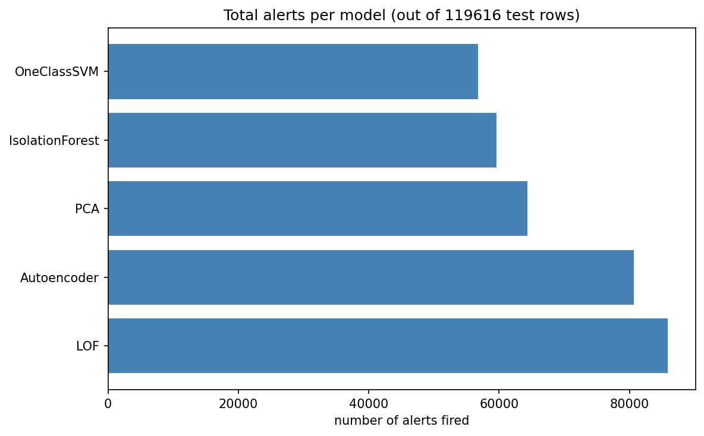

# Unsupervised Network Intrusion Detection on CIC-IDS2017

This project tries to detect network attacks **without using any labels during
training**. Five models learn what normal traffic looks like, and only at the
very end do we check the labels to see how well each model did.

## What's in the dataset

CIC-IDS2017 is a network traffic dataset with 5 days of captured flows. I used
5 cleaned CSV files:

| File | What's in it |
|---|---|
| `monday_clean.csv` | Only normal traffic, no attacks |
| `Tuesday_Patator_clean.csv` | Normal traffic + FTP-Patator + SSH-Patator (brute force attacks) |
| `friday_DDoS_clean.csv` | Normal traffic + DDoS |
| `friday_portscan_clean.csv` | Normal traffic + PortScan |
| `friday_Mrg_bot_clean.csv` | Normal traffic + Bot |
| `Wednesday_DoS_Hb_clean.csv` | Normal traffic + DoS + Heartbleed |
| `Thursday_Web_clean.csv` | Normal traffic + Web Attacks |
| `Thursday_Infiltration_clean.csv` | Normal traffic + Infiltration |

# My Network Intrusion Detection Project — The Story

**Original project:** https://github.com/PoojaChavanPatil/securite-anomaly-detection_new/tree/main

This file explains,what I built, how it grew, and what I learned along the way — including two interview questions that pushed me to add new things to the project.

---

## 1. What I built, in simple words

I wanted to build a system that can catch hackers attacking a computer network but without ever showing the computer any examples of "this is an attack" during training. 
This is called **unsupervised learning**. I only showed the model normal, safe traffic (from Monday, which has zero attacks in it), and let it learn on its own what "normal" looks like. Anything that looks different from normal later gets flagged.

I used five different models to do this: 
Isolation Forest, One-Class SVM, LOF, PCA, and an Autoencoder. 
Each one looks for "different from normal" in its own way like five different security guards, each trained to notice a different kind of suspicious behavior.

---

## 2. The story of how the project grew

**Step 1 — I started small, then added more data.**
My first version used 5 files. Later, I added 3 more files — Wednesday's DoS/Heartbleed attacks, Thursday's Web Attacks, and Thursday's Infiltration attacks,so I had all 8 files, covering every attack type in the dataset.

**Step 2 — I found a hidden bug that was hiding my rare attacks.**
When I looked closely, I noticed something wrong. Some attacks are extremely rare: Heartbleed only has 11 examples in the whole dataset, Infiltration has 36.
When I picked a random sample of data to test my models on, these rare attacks almost never showed up one time I checked, I got only 1 Heartbleed row and 3 Infiltration rows instead of the real numbers. 
That's not enough to know if my model can catch them at all.

So I fixed it. Instead of picking data completely at random, I made sure every attack type is guaranteed a fair spot in my test data common attacks get capped at 20,000 rows so they don't take over everything, but rare attacks always keep every single row they have. 
After this fix, all 14 attack types showed up properly, every time.

**Step 3 — I answered my own project's main question: "how many alerts is each model sending?"**
This was the real goal of my project. 
I built a table showing exactly how many alerts each model fires, how many were correct, how many were false alarms, and how many attacks it completely missed.
I also broke this down by attack type, and made a chart to see it visually.

What I found: my LOF model was the loudest it flagged about 72% of all traffic, but it also caught the most real attacks. My quietest model, One-Class SVM, flagged less than half the traffic, but it also missed the most attacks. 
So "loud" and "quiet" aren't automatically "bad" or "good" — I had to look deeper.

**Step 4 — I tried combining models, and it didn't fully work and that's okay.**
I thought: what if I only trust an alert when 2 or more models agree? I tested it. 
The result: fewer false alarms, but also more missed attacks because some attacks were only caught by LOF, and no other model backed it up. 
So I kept LOF as my strongest single model instead of forcing all models to agree. Not every idea works, and that's a real, honest finding too.

**Step 5 — I made alerts smarter, not just "yes or no."**
Instead of a flat "attack" or "not attack," I built a severity system: Low, Medium, High.
I also checked something important does "High" really mean "I'm very sure this is an attack"? 
For 4 out of 5 models, yes, higher severity meant higher confidence, exactly as expected. 

But LOF broke this pattern its "High" alerts were actually less trustworthy than its "Medium" ones. That was a surprising, useful thing to learn.

---

## 3. Two interview questions that pushed me further

While preparing for interviews, I was asked two real questions that made me go back and add new things to my project. 
Here they are, told as a story of how I thought through each one.

### Question 1: If one of your models sends too many alerts, how would you manage that?

At first, this felt like a simple question just "raise the threshold." But I realized that's not a complete answer. So I looked at my own numbers again.

I found that LOF, my loudest model, wasn't just noisy for no reason it was noisy *because* it's the only model good at catching sneaky attacks like brute-force logins and web attacks.
If I just turned its volume down, I'd also lose the attacks only it can catch.

**So here's how I'd actually manage it, step by step:**

1. First, figure out *where* the extra alerts are coming from are they spread out everywhere, or clustered around one specific thing?
2. Re-tune the threshold carefully for each model, instead of using one flat number for all of them.
3. Use severity tiers (Low/Medium/High) so a security analyst reviews the most confident alerts first, instead of treating every single alert the same.
4. Only require multiple models to agree for the *most* important escalations not everywhere, since I proved that costs real detections.
5. In a real company, I'd also group repeated alerts from the same source into one single alert (instead of a hundred small ones), and build a feedback loop where analysts mark alerts as "real" or "false," and the system slowly gets smarter from that feedback over time.

**In real life, this matters because:** if a security team gets flooded with too many alerts, they eventually start ignoring all of them including the real attacks. 

That's how actual companies get hacked even though their system "did" send a warning.
So managing alert volume isn't about silence it's about making sure the right alerts get seen first.

### Question 2: If your product is used by two hospitals, and one works fine but the other doesn't, what would you do?

This question stuck with me, because I didn't have real data from two different hospitals to test with.

I didn't want to just talk about it in theory I wanted to actually show I could investigate it. 
So I built the closest honest version I could, using data I actually had: I compared Monday's traffic (what my model learned from) against the *normal* traffic from the other days, and treated those as a stand-in for "two different places."

**Here's the story of what I found, step by step:**

- **First, I did a simple comparison** of average values between the two. It looked alarming some numbers were off by tens of thousands of percent! But when I looked closer, I found the problem wasn't real drift it was broken data (some values were impossible, like a negative header length).
- This taught me: don't trust the first simple number you see, always sanity-check it.

- **So I used a better method** — a proper statistical drift test (PSI and KS test) on every feature. This time, the results looked calm every feature showed only mild differences, nothing alarming.
  
- **But I didn't stop there.** I asked one more question: does this "mild" difference actually matter to the model? So I took my trained model and tested it directly on the "other site's" normal traffic, and checked how many false alarms it created.
 The answer surprised me: **11.49%** of totally normal traffic got wrongly flagged as an attack more than double what it should have been.

**The real lesson:** no single feature looked dramatically different on its own, but small little differences across many features added up, and the model ended up over twice as trigger-happy on the new "site" as it should have been. 
Checking the model's actual real-world behavior told me something that checking the raw numbers alone completely missed.

**So here's what I'd actually do in a real hospital deployment:**

1. Before assuming anything is broken, run this exact test on the real second hospital's data check feature drift, then check the model's actual false-alarm rate on their normal traffic.
2. Talk to the hospital's IT team maybe they simply have different devices or network setup, which has nothing to do with the model itself.
3. Check if my training data was fair to both hospitals, or if it leaned heavily toward just the first one that's often the real root cause.
4. Personally look at a sample of the alerts with someone from that hospital, to check if they're truly wrong, or just unusual-but-harmless traffic (like a nightly backup job).
5. Keep checking this over time, not just once 

---

## 4. What I'm most proud of, honestly

I didn't just run five models and pick the best score. I found a real bug in how I was testing rare attacks and fixed it. I tried an idea (combining models) that didn't fully work, and I kept that honest result instead of hiding it. And when asked a hard interview question I couldn't fully answer with real data, I built the closest honest version I could, said clearly what it wasn't, and still found something genuinely useful from it.

That, to me, is the real point of this project — not just getting good numbers, but learning to question my own results before trusting them.

### Threshold Sweep

### Alters per model

### per_attack_heatmap

