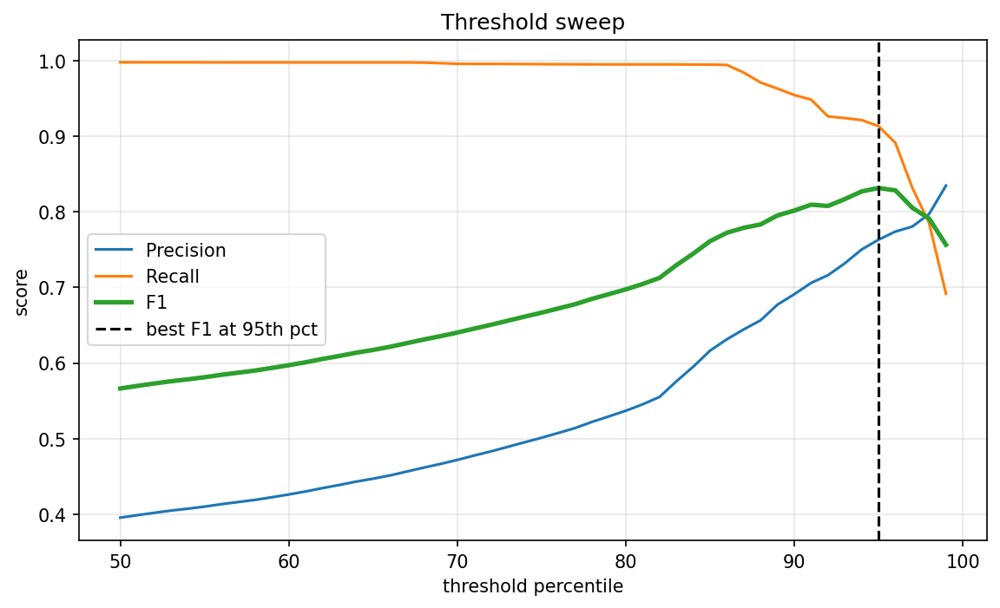
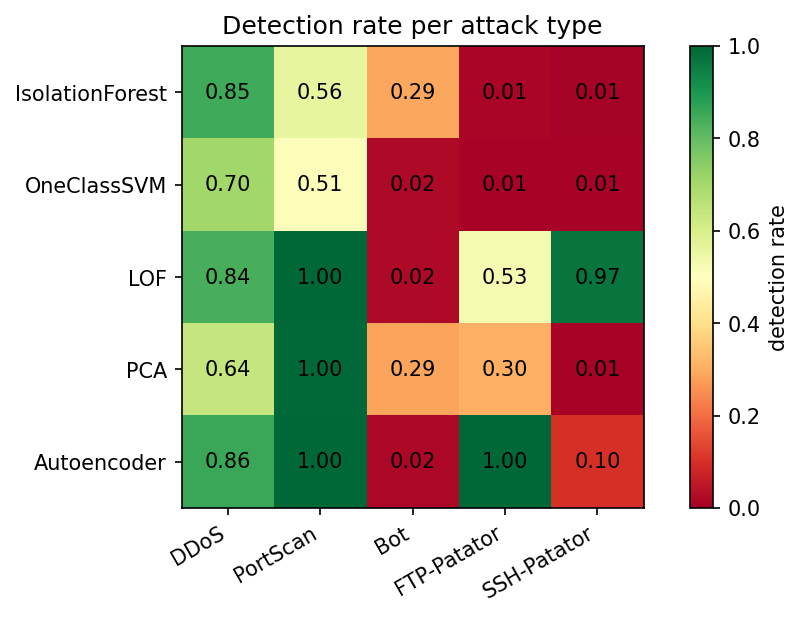
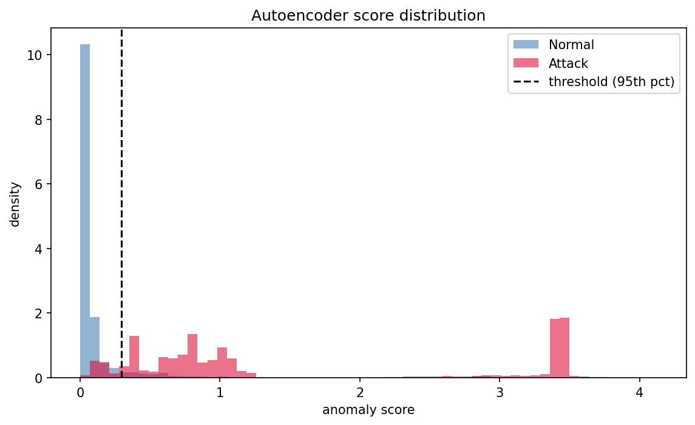

# Unsupervised Network Intrusion Detection on CIC-IDS2017

This project tries to detect network attacks **without using any labels during
training**. Five models learn what normal traffic looks like, and only at the
very end do we check the labels to see how well each model did.

## What's in the dataset

CIC-IDS2017 is a network traffic dataset with 5 days of captured flows. I used
5 cleaned CSV files:

| File | What's in it |
|---|---|
| `monday_clean.csv` | Only normal traffic, no attacks |
| `Tuesday_Patator_clean.csv` | Normal traffic + FTP-Patator + SSH-Patator (brute force attacks) |
| `friday_DDoS_clean.csv` | Normal traffic + DDoS |
| `friday_portscan_clean.csv` | Normal traffic + PortScan |
| `friday_Mrg_bot_clean.csv` | Normal traffic + Bot |

Each row is one network flow (a connection between two devices) with about 78
columns describing it — packet counts, duration, byte counts, flag counts, etc.

## The idea

Monday has zero attacks in it, so it tells us what "normal" looks like. I train
5 models on Monday only. None of them ever see a label while training.

Then I run all 5 models on the other 4 files (which do have attacks) and see
which flows each model flags as "weird." Only after that do I open up the real
labels and check how many attacks were actually caught.

This matters because in real life you usually don't have labelled attack data
to train on — you only have normal traffic. So this setup mimics a real
situation.

## The 5 models

| Model | Basic idea |
|---|---|
| Isolation Forest | Attacks are easier to isolate with random splits than normal traffic |
| One-Class SVM | Draws a boundary around normal traffic, anything outside is flagged |
| Local Outlier Factor (LOF) | Flags points that sit in a low-density area compared to their neighbours |
| PCA reconstruction | Compresses and rebuilds each row — attacks rebuild badly |
| Autoencoder | Same idea as PCA but using a small neural network instead |

## How to run it

1. Clone this repo
2. Install the packages:
   ```bash
   pip install pandas numpy scikit-learn matplotlib plotly
   ```
3. Download the 5 CIC-IDS2017 CSV files (link in Data section below) and put
   them in one folder
4. Open `Final_Unsupervised_Anomaly_Detection.ipynb` in Jupyter
5. In the second cell, change the `path` variable to point at your folder:
   ```python
   path = "your/folder/path/here/"
   ```
6. Run all cells top to bottom (Kernel → Restart & Run All)

The whole notebook takes about 3–5 minutes to run.

## Data

The dataset is from the Canadian Institute for Cybersecurity:
https://www.unb.ca/cic/datasets/ids-2017.html

The CSVs used here are the cleaned versions (missing values and infinities
already removed, column names stripped of extra spaces).

## What I found

**Accuracy alone doesn't mean much here.** About 26% of the test data is
attacks, so a model that predicts "normal" every single time still gets 74%
accuracy. I mainly looked at PR-AUC and the F1 score of the attack class
instead.

**Autoencoder came out on top**, catching about 91% of attacks with about 76%
precision. PCA was a close second. One-Class SVM was the weakest and also the
slowest to train.

**The bigger finding is in the per-attack breakdown, not the overall score.**
Averaging across all attacks hides a lot:

- DDoS and PortScan are detected really well by almost every model (85–99%)
- Different models are good at different brute-force attacks — Autoencoder
  catches FTP-Patator well but barely catches SSH-Patator, LOF is the opposite
- Bot is the one attack that basically none of the models can catch well (under
  30% no matter which model)

Bot traffic is built to look like normal web traffic, and since every model
here only looks at one network flow at a time, there isn't much in a single
flow to tell it apart from something normal. Catching it properly would
probably need features built across multiple flows over time, not just a
better model.

## Notes on the code

- The threshold used to decide "is this an attack" is picked from the training
  data only (95th percentile of the scores on Monday), not from the test
  labels. This keeps the whole thing honestly unsupervised.
- The labels are only used once, right before printing the results — never
  during training or scoring.
- `QuantileTransformer` is used instead of `StandardScaler` because a few
  columns like Flow Duration have very extreme outliers that would otherwise
  dominate the distance-based models (LOF, One-Class SVM).

## Limitations

- Only about 50,000 rows of Monday were used for training and 200,000 rows for
  testing, to keep runtime reasonable. Using the full dataset would likely give
  slightly different numbers.
- Each row is judged on its own. Attacks that only look unusual as a *pattern
  over time* (like many failed logins in a row) are hard for these models to
  catch.
- Only one random seed was used, so the exact numbers could shift a bit on a
  different run.
- The analysis was conducted on the Monday, Tuesday, and Friday (morning and afternoon) datasets; Wednesday and Thursday data were not included.
  

## Results

### Threshold Sweep


### Per-Attack Detection Rate


### Score separation

